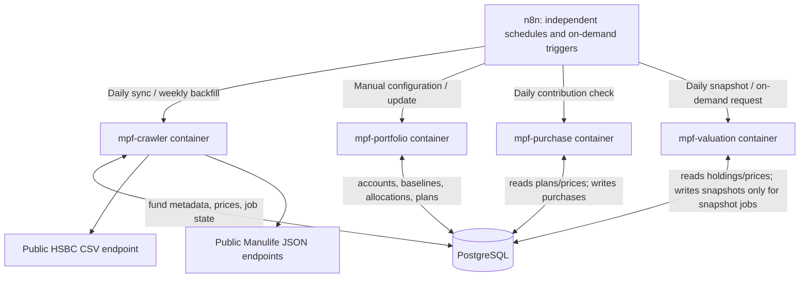

# MPF Portfolio Tracker — Codex Implementation Specification

**Version:** 0.1
**Date:** 2026-10-09  
**Status:** Approved architecture / implementation requested  
**Target:** Self-hosted Docker, Python 3.12+, FastAPI, PostgreSQL, existing n8n installation  
**Repository:** `./src/` (inspect the repository before changing anything)

> **Core architectural decision:** Four independently deployed application containers (`mpf-crawler`, `mpf-portfolio`, `mpf-purchase`, `mpf-valuation`) share a PostgreSQL database container. Existing n8n schedules and triggers each service **independently** over HTTP. A crawler job **must not automatically trigger** contribution processing or valuation. The valuation service **must not fetch fund prices**.

## 1. Goal

Build a self-hosted MPF tracking system for HSBC and Manulife that can:

1. Download and store current fund prices and recover historical prices.
2. Initialize and maintain the user's verified MPF accounts, fund-unit holdings, expected monthly contributions, and allocation rules.
3. Estimate purchases on configured expected contribution/purchase dates, without misrepresenting estimates as confirmed transactions.
4. Calculate a daily stored portfolio valuation, **on its own schedule**, and calculate a read-only on-demand valuation when requested.
5. Reconcile later against actual eMPF unit holdings and accurately report estimated versus confirmed values.

**Non-goals for initial release:** eMPF login automation, eMPF private APIs, web scraping with a headless browser, placing actual trades, fetching live prices on every valuation request, a full frontend, multi-user tenancy, brokerage integration, or deploying public Internet endpoints. Build reliable APIs and CLI tools first; n8n/Telegram integration comes after the services work.

### Confirmed decisions

| Decision | Choice |
|---|---|
| Language | Python 3.12+ |
| HTTP API | FastAPI + Pydantic |
| Database | PostgreSQL, not SQLite |
| Deployment | Docker Compose; four application containers plus one PostgreSQL container |
| Scheduler and manual triggers | Existing n8n via internal HTTP calls |
| Crawler timing | Separate daily price sync and weekly history backfill |
| Purchase timing | Independent scheduled job |
| Valuation timing | Independent scheduled snapshot job **and** read-only on-demand request |
| Communication | Shared PostgreSQL data; no automatic service-to-service calls in ordinary scheduled workflows |
| Storage | Persistent host-mounted PostgreSQL data directory and backed-up migrations/configuration |
| Financial arithmetic | Python `decimal.Decimal`, PostgreSQL `NUMERIC`; never binary float for prices, units or money |

## 2. System diagram



**Critical:** All four application containers can be running simultaneously. Database row ownership, database transactions, unique constraints and idempotency are required; there must be no shared application filesystem assumptions. The existing n8n deployment should connect to the same *private* Docker network, but n8n does not need direct database access.

## 3. Service boundaries and ownership

### 3.1 `mpf-crawler` — Fund Price Collector

- Owns fund-master records, fund/scheme membership mapping, daily fund prices, and crawler execution status.
- HSBC direct CSV download, wide-to-long normalization, configurable date range and bounded date chunks.
- Manulife `fundslist` for latest per-fund NAV and metadata.
- Manulife `fundhistory` for historical recovery on a fund-by-fund basis; parse the **actual** payload schema before implementation.
- Daily sync and weekly backfill are *separate jobs*; scheduling belongs to n8n.
- No personal account data, contribution processing, portfolio valuation, or Telegram notifications.

### 3.2 `mpf-portfolio` — Portfolio Configuration and Reconciliation

- Owns portfolio accounts, verified unit baselines, dated allocation rules, contribution plans, manual adjustments and reconciliation records.
- Allows initial holdings entered as actual units. If only fund market value is known, may derive provisional units from the appropriate fund price, clearly flagged `ESTIMATED`.
- Stores contribution amounts, account-level allocations, effective dates and expected buy-in dates. Distinguish employee, employer and voluntary contribution streams if provided.
- Accepts subsequent actual holdings from eMPF to replace the current **calculation baseline**, without deleting original transactions or history.
- Does not run a scheduler or automatically purchase fund units.

### 3.3 `mpf-purchase` — Expected Contribution / Buy-in Engine

- Reads configuration and available historical prices; owns expected contribution events and estimated/confirmed purchase transactions.
- Independent daily n8n-triggered job; can also process a requested month/account manually.
- Never assumes that scheduled contribution date equals confirmed trade date.
- Creates one event per account/period/stream. Computes per-fund nominal amounts from the allocation rule effective for that period, then estimates units only once a valid price under the configured estimation policy is available.
- Uses idempotency keys / unique constraints; running the same job ten times must not create extra units.
- Can reconcile estimated purchase records against actual transaction details, if later supplied. When only an updated actual balance is supplied, the portfolio service records a new verified baseline instead.
- No actual MPF orders or asset purchases: this service only models transactions.

### 3.4 `mpf-valuation` — Read-only Calculation + Historical Snapshots

- Reads verified baselines, later eligible transactions, latest eligible fund prices and FX rates only where relevant.
- Independent daily job calculates and persists a dated snapshot; **it does not call the crawler or purchase service**.
- On-demand GET calculates current/as-of value without modifying holdings, transactions or snapshots.
- Preserves price publication date for every fund and reports stale/unpriced holdings distinctly.
- Computes per-fund / per-account / per-provider / total value, estimated vs confirmed coverage, changes attributable to market price, net external cash flows, and configured period returns.
- Snapshot history is derived data that can be marked stale and rebuilt following price corrections or later verified baselines.

## 4. Actual source URLs and verified fixture findings

The source files in the Codex package are:

- `fixtures/hsbc_all_supertrust_20260901_20261007.csv`
- `fixtures/manulife_fundslist.json`

These are **real example payloads supplied by the user**, not invented samples. Treat them as test fixtures. Do not edit them.

### 4.1 HSBC — all-funds CSV

```http
GET https://rbwm-api.hsbc.com.hk/wpb-gpbw-mmw-hk-hbap-pa-p-wpp-mpf-market-data-prod-proxy/v1/download-funds
  ?schemeCodes=HB
  &fundPricePeriodFrom=2026-10-01
  &fundPricePeriodTo=2026-10-07
  &language=en_US
```

- Do **not** add `fundCode` for all-funds download. The user's test confirmed HTTP 200 and `Content-Type: text/csv;charset=utf-8`, returning 20 funds in one response.
- `fundCode=FMF` is a single-fund example for **Age 65 Plus Fund**; do not require fund codes for the all-funds pipeline.
- Fixture: 20 fund rows, 26 unique published dates from 2026-09-01 to 2026-10-07, 53 CSV columns (first fund-name column plus 26 BID/OFFER pairs); normalizing produces **520 fund-date price records**.
- First CSV row: each price date occurs twice. Second row: corresponding `BID`, `OFFER`. Each subsequent row: fund name followed by numeric prices.
- Parse with Python `csv` and `Decimal` (including optional UTF-8 BOM). Validate equal row width, paired headers, valid calendar dates, numeric prices and repeated date/price-type collisions.
- Store BID and OFFER separately; **do not** assume they are always equal even if the fixture shows equality.
- Support configurable date chunks, at most **28 calendar days** by default (a conservative client convention; verify service restrictions in live tests). Do not assume a large date request always returns full history.
- `fund_name` must be mapped to a persistent internal ID in the `HB` scheme; maintain an alias mechanism for future renames.
- Save the actual published `price_date` rather than the HTTP download date. Holidays need not have a price entry.

### 4.2 Manulife — full fund list and latest price

```http
GET https://scmpf.manulife.com.hk/bin/funds/fundslist
  ?productLine=mpf
  &overrideLocale=en_HK
```

The uploaded JSON is an **array of 76 fund records**. Observed fields:

```json
{
  "fundId": "SHK122",
  "fundName": "Manulife MPF Stable Fund**",
  "productsId": ["8"],
  "currency": "HKD",
  "displayFrontend": true,
  "nav": {
    "asOfDate": "2026-10-06",
    "price": "17.284",
    "changePrice": "0.02499999999999858",
    "changePercent": "0.1448519612955477"
  }
}
```

Fixture observations:

- 76 records total; product association is `productsId=["8"]` on 31 and `productsId=["22"]` on 45. **Do not silently equate all 76 with one plan**, nor hard-code 29 without verifying product selection.
- 75 records have a positive `nav.price` in the fixture; one record, `DHK121` (`Manulife MPF Interest Fund***`), has `nav.price="0"`, a stale 2025-09-01 date, and `nav.fundInterestInd="Y"` / `nav.fundIntRate="0.875"`. Retain as a valid *fund record* but **not** as a normal zero-priced NAV entry. Interest-bearing treatment is deferred until validated.
- Some records have `displayFrontend=false`; retain their fund identities and product associations, and provide an explicit configuration if selection should exclude hidden products.
- `nav.asOfDate` is a per-fund published date and may differ across funds. `changePercent` is a reported **percentage value**, not a price.
- Use `fundId` for stable fund identity, prefixed by provider where necessary. Do not depend on display names or floating-point conversion.
- Store prices at the actual `nav.asOfDate` for each fund. Do not mark all 76 with the crawler's execution date.
- The list contains recent NAVs, **not a full per-day historical series**.

### 4.3 Manulife — fund-specific historical prices

```http
GET https://scmpf.manulife.com.hk/bin/funds/fundhistory
  ?id=SHK122
  &productLine=mpf
  &overrideLocale=en_HK
```

- This URL was discovered by the user. **The response body/schema has NOT been supplied or verified in this project.** First fetch a real example and save a sanitized fixture as `fixtures/manulife_fundhistory_SHK122.json`.
- Only after inspecting the actual JSON, implement the correct date/price parser and coverage limits. Do not invent `record["date"]`, assume a top-level array, assume unlimited history, or claim success without tests.
- Weekly recovery should fetch history for relevant tracked funds and ingest the **latest 14 calendar days**. The API may transmit more data than this; process/filter the response on the crawler side before database insert. Do not expand all historic entries into n8n items.
- Manual backfill must accept an explicit date range and report missing/unavailable source coverage without fabricated prices.
- Use a bounded concurrency pool (initially 3 simultaneous requests), timeouts, 429/5xx retry/backoff, and per-fund diagnostics.

### 4.4 Source access and data provenance

- These URLs are publicly reachable web-page backing endpoints but **not documented contractual third-party APIs**. The crawler must tolerate changed schemas, 403 responses, rate limiting, and access terms. Do not attempt to bypass access controls or challenges.
- No eMPF login, cookies, passwords, tokens, or personal account credentials are required for **public fund price collection**.
- Preserve provider, source endpoint identifier, fetched timestamp, and per-record publication date. It is optional to archive raw price payloads to `data/raw/`; do not log secrets.

## 5. Data model — PostgreSQL

Use **one PostgreSQL instance** and an `mpf` database, with migrations controlled centrally (Alembic or SQL migrations executed by an explicit one-shot migration command). Do not have all four services run migrations concurrently at startup.

### Required core tables and ownership

| Table | Owner/service allowed to write | Key constraints / significant fields |
|---|---|---|
| `funds` | crawler | `fund_id PK`, `provider`, `provider_fund_code`, `name`, `currency`, `asset_class`, `risk_rating`, `interest_fund_flag`, `last_seen_at`, `metadata JSONB` |
| `fund_aliases` | crawler | `(fund_id, alias) UNIQUE`; source renamed funds map to stable ID |
| `fund_scheme_memberships` | crawler | `(fund_id, provider_scheme_code) UNIQUE`; preserve Manulife product IDs |
| `fund_prices` | crawler | `(fund_id, price_date) PK`, `bid NUMERIC`, `offer NUMERIC`, `nav NUMERIC`, `source`, `fetched_at` |
| `accounts` | portfolio | `account_id PK`, `provider`, `scheme`, `display_label`, `currency`, `active` |
| `holdings_baselines` | portfolio | `baseline_id PK`, `account_id`, `fund_id`, `effective_date`, `units NUMERIC`, `source`, `verification_status`, `created_at` |
| `allocation_rules` | portfolio | `rule_id PK`, `account_id`, `fund_id`, `contribution_stream`, `effective_from`, `effective_to`, `weight NUMERIC` |
| `contribution_plans` | portfolio | `plan_id PK`, `account_id`, `contribution_stream`, `amount NUMERIC`, `expected_day/date rule`, `effective range`, `active`, estimation policy |
| `contribution_events` | purchase | `event_id PK`, `(plan_id, period) UNIQUE`, `expected_date`, `amount`, `status` |
| `purchase_transactions` | purchase | `transaction_id PK`, `event_id`, `fund_id`, `trade_date`, `cash_amount`, `unit_price`, `units_delta`, `status`, `estimation_policy`; `(event_id, fund_id) UNIQUE` |
| `portfolio_snapshots` | valuation | `(account_id, as_of_date) UNIQUE`, `total_value`, `currency`, `calculation_status`, `calculated_at`, `revision` |
| `snapshot_fund_values` | valuation | `(account_id, as_of_date, fund_id) UNIQUE`, `units`, `price_date`, `price_used`, `value`, `price_status`, `units_status` |
| `jobs` | service-scoped | `job_id`, `service`, `job_type`, `status`, `idempotency_key`, `request JSONB`, `result JSONB`, `attempts`, `lease_until`, timestamps, error; unique `(service, idempotency_key)` |

Supplementary tables for transaction corrections, audit trail, FX rates or reconciliation may be added when justified. Do not store an unversioned, directly mutated `current_units` as the sole source of truth.

### Ownership and grants

- Create independent DB credentials for four services. Each service gets `SELECT` on tables needed for calculations and `INSERT/UPDATE/DELETE` only on its owned tables. If this is too involved for local development, at minimum enforce ownership in code and document the production grants.
- Only migration tooling owns schema DDL. Database `postgres` superuser credentials must not be passed to application services.
- Keep `fund_prices` as published historical facts; any revised price changes a value via idempotent UPSERT and records updated timestamp. Do not delete unrelated days.

### Precision, currency and pricing policy

- Use `NUMERIC(24, 10)` (or equally safe precision) for units and NAV; use `NUMERIC(24, 8)` or more for money. Round only at explicitly documented presentation/ledger boundaries.
- Store `HKD` or the actual source currency; for mixed currencies, no silent exchange-rate assumptions. In v1, reject or flag any fund/cash currency mismatch until a validated FX source exists.
- Valuation uses a **configurable provider-specific price convention**: e.g., HSBC BID as indicative realizable unit price, Manulife NAV. Do not silently swap BID/OFFER/NAV. Confirm against actual eMPF balance during reconciliation.
- Null/unavailable is different from zero. Zero `nav.price` on the Manulife interest-fund record is **not** an ordinary market price.
- All DB timestamps are `TIMESTAMPTZ` (UTC internally); business schedule/date comparisons use `Asia/Hong_Kong` and SQL `DATE`.

## 6. Holdings, expected purchases and reconciliation

### 6.1 Initial portfolio

For each actual account, allow verified records with:

- Provider, scheme, account display label (not personally identifying account numbers unless essential).
- Fund selection by stable `fund_id`.
- Valuation/baseline date.
- **Actual units** and, optionally, provider-reported market value for reconciliation.
- `verification_status = VERIFIED` for user-entered values copied from eMPF; `ESTIMATED` if units were inferred from reported fund value and NAV/BID.

If only a **total account balance** is supplied, **do not invent each fund's holding breakdown**. Require per-fund balances, units, or another valid breakdown.

### 6.2 Allocation versioning

An allocation record has an effective period. A new change creates a new version; it does not rewrite historical periods. Validate each `(account, contribution_stream, effective period)` fund weight sum = 100% unless explicitly defined as incomplete/draft. Support different splits between employee/employer streams where applicable.

### 6.3 Purchase event state machine

Proposed states:

```text
EXPECTED -> WAITING_FOR_PRICE -> ESTIMATED -> CONFIRMED
                      \-> FAILED_REVIEW
ESTIMATED -> ADJUSTED (on actual confirmation)
EXPECTED  -> CANCELLED
```

- `EXPECTED`: schedule due soon/not yet completed; no units added to confirmed holdings.
- `WAITING_FOR_PRICE`: due date passed but a valid eligible fund price is not yet published.
- `ESTIMATED`: synthetic unit purchase using a defined price/date assumption, visibly labeled estimate.
- `CONFIRMED`: verified trade date/units supplied by an authoritative account record.
- `ADJUSTED` / corrected: preserve audit history; a correction must not create duplicate economic units.

**Policy:** A *configured expected purchase date* is a simulation assumption, **not proof** that the trustee invested funds on that date. Make policy configurable: e.g., first published NAV/BID with `price_date >= expected_date`, within a bounded allowance. Persist which actual `price_date` was chosen and flag the difference. If no valid price is available, do not fabricate units or silently use a future price for an earlier valuation. Do not book expected contributions as realized investments just because a cron job ran.

**Idempotency:** `(plan_id, month)` is unique for expected event; `(event_id, fund_id)` is unique for its fund purchase. Use database UPSERT/transactions and, if concurrent workers are possible, `SELECT ... FOR UPDATE SKIP LOCKED` or advisory locks.

### 6.4 Holdings calculation

For a requested `as_of_date`, find each fund's **most recent applicable baseline** at or before that date and include eligible unit-changing transactions **strictly after that baseline's effective date and no later than `as_of_date`**:

```
Effective Units(as_of_date) = Verified/Estimated Baseline Units
                            + SUM(Eligible Unit Deltas After Baseline)
```

Define eligibility explicitly (confirmed only vs confirmed-plus-estimated), return both if useful, and never double-count a purchase that has been incorporated into a later verified baseline.

### 6.5 Reconciliation

- Portfolio API accepts new verified eMPF units per fund and effective date.
- Reconciliation computes difference from previously estimated units and stores audit metadata.
- Record a new baseline or an auditable correction; **do not erase historical transactions**.
- Mark snapshots at/after affected date as needing recomputation and expose an explicit rebuild job or scheduled repair policy.

## 7. Valuation rules

### Daily stored snapshot

- Independently triggered via `POST /v1/valuation/jobs/snapshot` on the valuation service.
- For each fund holding, use most recent **eligible published** price with `price_date <= requested as_of_date`.
- Never use a price published *after* the valuation `as_of_date` (look-ahead bias).
- Include `price_date`, `days_stale`, price type (`BID`/`NAV`) and units verification status in the result.
- Partial data should yield `PARTIAL` / `STALE` and a breakdown of excluded/unpriced holdings; **never report a misleading apparently complete total**.
- Upsert one logical snapshot per `(account_id, as_of_date)` with revision history or a defensible overwritten-derived-value strategy.
- Do not require the crawler to succeed on that day; the snapshot reports precisely which published dates were used.

### On-demand valuation

- `GET /v1/valuation/latest` and `GET /v1/valuation/as-of?date=YYYY-MM-DD` calculate from DB only.
- Default read requests are **side-effect free**: no new purchases, crawls or snapshot writes.
- For historical valuations, use historical holdings as of that date, not today's units.
- Include per-fund and per-account breakdown and at least `calculated_at`, `requested_as_of`, `provider_price_date`, `source`, `is_estimated`, `is_stale`.

### Performance calculations

Distinguish these metrics (do not conflate them):

1. **Market value:** `units × selected published price` (per fund).
2. **Market-value change:** value difference, which includes contributions and transfers.
3. **Approximate investment P&L for a period:** `ending value - beginning value - net external cash flows` (with correct treatment of withdrawals/transfers and timing); label it as an approximation if flows lack actual investment dates.
4. **Return % / XIRR:** **only** where the required cash-flow history is complete; otherwise return `insufficient_data`, not an invented percentage.

## 8. External HTTP API contract (FastAPI)

Use JSON request/response models, OpenAPI docs, `/health`, authentication on all non-health endpoints (e.g., `X-API-Key` or bearer token), request validation, structured errors, and stable `/v1` prefixes. Idempotency keys on POST jobs. Examples below are the *contract to implement*, not currently deployed APIs.

### 8.1 Crawler container (`http://mpf-crawler:8000`)

| Method | Path | Function |
|---|---|---|
| `POST` | `/v1/crawl/jobs/sync` | Create daily latest-price sync job for `hsbc`, `manulife` or `all` |
| `POST` | `/v1/crawl/jobs/backfill` | Create historical recovery job; date range and providers |
| `GET` | `/v1/crawl/jobs/{job_id}` | Get state, dates processed, counts, failures |
| `GET` | `/v1/funds` | Public fund metadata in DB (authenticated) |
| `GET` | `/health` | Container/database health |

```json
POST /v1/crawl/jobs/sync
{"provider":"all","rolling_days":7}
```

```json
POST /v1/crawl/jobs/backfill
{"provider":"all","from_date":"2026-09-01","to_date":"2026-10-07","manulife_filter_days":14}
```

For an explicit manual backfill, `from_date`/`to_date` take precedence over routine filters; don't silently cut manually requested recovery to 14 days.

### 8.2 Portfolio container (`http://mpf-portfolio:8000`)

| Method | Path | Function |
|---|---|---|
| `POST` | `/v1/accounts` | Create an MPF account |
| `GET` | `/v1/accounts` | List accounts |
| `POST` | `/v1/accounts/{id}/baselines` | Record per-fund verified/estimated holdings baseline |
| `GET` | `/v1/accounts/{id}/holdings` | Show recorded baselines and units status |
| `PUT` | `/v1/accounts/{id}/allocation-rules` | Publish versioned allocation rules |
| `PUT` | `/v1/accounts/{id}/contribution-plans` | Set monthly contribution amount/date/stream |
| `POST` | `/v1/accounts/{id}/reconciliations` | Record authoritative holdings correction |
| `GET` | `/health` | Health |

### 8.3 Purchase container (`http://mpf-purchase:8000`)

| Method | Path | Function |
|---|---|---|
| `POST` | `/v1/purchase/jobs/process-due` | Independent scheduled process of due expected contributions |
| `GET` | `/v1/purchase/jobs/{job_id}` | Job status |
| `GET` | `/v1/purchase/events` | List expected/pending/estimated events |
| `POST` | `/v1/purchase/events/{id}/confirm` | Confirm against documented real purchase transaction |
| `GET` | `/health` | Health |

### 8.4 Valuation container (`http://mpf-valuation:8000`)

| Method | Path | Function |
|---|---|---|
| `POST` | `/v1/valuation/jobs/snapshot` | Independent scheduled snapshot creation |
| `GET` | `/v1/valuation/jobs/{job_id}` | Job status |
| `GET` | `/v1/valuation/latest` | Calculate latest eligible as-of value, read-only |
| `GET` | `/v1/valuation/as-of?date=YYYY-MM-DD` | Calculate historical as-of, read-only |
| `GET` | `/v1/valuation/history?from_date=...&to_date=...` | Stored snapshot series |
| `POST` | `/v1/valuation/jobs/rebuild` | Rebuild stale/invalidated historical snapshots |
| `GET` | `/health` | Health |

Use explicit parameters for `account_id` vs all-account aggregate. All endpoints must validate input and consistently handle missing price/account/fund cases.

### Async job implementation requirement

The API should enqueue long-running jobs to a **durable PostgreSQL-backed job table** and immediately return HTTP `202` with `job_id`. A worker loop within the corresponding service container can claim jobs transactionally with a lease (`FOR UPDATE SKIP LOCKED` or equivalent), update heartbeats, and recover timed-out jobs after restarts. Do not rely on an untracked FastAPI `BackgroundTasks` callback as the *only* record of work; do not add Redis/Celery unless genuinely necessary. For simple requests, a synchronous implementation may exist internally, but public n8n job endpoints should support polling and retries.

Job result example:

```json
{
  "job_id": "<uuid>",
  "service": "crawler",
  "status": "succeeded",
  "result": {
    "providers": ["hsbc", "manulife"],
    "funds_seen": 96,
    "price_rows_inserted": 101,
    "price_rows_updated": 12,
    "funds_failed": []
  }
}
```

Counts here are **illustrative**, not expected production values. Report actual counts and partial failures.

## 9. n8n scheduling (independent workflows)

n8n invokes services, polls `/jobs/{id}`, handles timeouts and Telegram alerts, but never receives full historical JSON/CSV. Use one workflow per independent responsibility:

| Workflow | Example schedule (`Asia/Hong_Kong`) | Destination | Dependency policy |
|---|---|---|---|
| `MPF-01 Daily Prices` | Daily 07:00 | `mpf-crawler /v1/crawl/jobs/sync` | No dependency |
| `MPF-02 Weekly Backfill` | Sunday 07:30 | `mpf-crawler /v1/crawl/jobs/backfill` | No dependency; refresh recent 14 days of Manulife and up to 28 days HSBC |
| `MPF-03 Expected Purchases` | Daily 08:00 | `mpf-purchase /v1/purchase/jobs/process-due` | Independently runs; leaves missing-price events pending |
| `MPF-04 Daily Valuation` | Daily 08:30 | `mpf-valuation /v1/valuation/jobs/snapshot` | Independently runs; warns on stale prices / pending purchases |
| `MPF-05 On-demand Value` | Telegram/manual webhook | `mpf-valuation /v1/valuation/latest` | Read-only; no crawl/transaction side effects |

**Schedules are examples only**; provider publication times must be verified and refined. There is no implicit `Crawler -> Purchase -> Valuation` API chain. A sequence in clock time does not make a job dependent on the prior job's success. If a price is missing or stale, label that outcome rather than inserting an imaginary price.

### n8n payload handling

- n8n sends small JSON bodies and receives only job IDs, status summaries and compact valuation results.
- Use retry and separate error notifications; never send raw credentials/DB passwords in logs.
- Provide **importable sample n8n workflow JSON** later in Phase 5 (do not modify the user's running n8n instance unless explicitly authorized).

## 10. Docker deployment and ops

### Target repo layout

```text
MPF/
├── IMPLEMENTATION.md                 # This document
├── compose.yaml
├── .env.example
├── .gitignore
├── migrations/                       # Single owner of PostgreSQL schema evolution
├── shared/                           # Shared typed models, DB and money/date helpers
├── services/
│   ├── crawler/                       # FastAPI + job runner + HSBC/Manulife clients
│   ├── portfolio/                     # FastAPI + configuration and reconciliation
│   ├── purchase/                      # FastAPI + contribution transaction engine
│   └── valuation/                     # FastAPI + calculation and snapshots
├── tests/
│   ├── fixtures/
│   ├── unit/
│   ├── integration/
│   └── e2e/
├── data/                              # Local dev only; gitignored if containing secrets
├── scripts/
└── README.md
```

### Docker Compose constraints

- Compose services: `mpf-db`, `mpf-crawler`, `mpf-portfolio`, `mpf-purchase`, `mpf-valuation`.
- `postgres:17` or another explicitly chosen supported major version; persist data in `./data/postgres` mounted to correct version-specific PGDATA path; include healthcheck and restart policy.
- Put application services and n8n on an existing *private* external Docker network, named by an `.env` value or documented default such as `automation`. Do not assume that network already exists—verify and document creation/connection.
- API services connect to PostgreSQL using service hostname `mpf-db`; do not publish PostgreSQL port to the host or Internet by default.
- API services should use `expose: 8000` and no public host port mapping. n8n resolves container service names on the shared network.
- Credentials via Docker secrets or an uncommitted `.env`; provide `.env.example`, no real passwords in repo.
- Configure host/network healthchecks, request timeouts, retries, time zone, concurrency controls and graceful shutdown.
- One-time migration command must finish before dependent services are considered ready.
- Provide `docker compose up -d --build`, `docker compose logs`, and `docker compose exec` troubleshooting commands in README.
- Backups: `pg_dump`/`pg_restore` (not raw copying of a live PostgreSQL data directory), automated periodic backup procedure and a tested restore runbook.
- Security: API key / bearer auth for mutating and private read endpoints; do not expose private MPF account data over public HTTP.

## 11. Testing and acceptance criteria

### Unit tests

- HSBC 2-row-date/BID/OFFER header parser unpivots the supplied fixture to **exactly 520 fund-date records**, corresponding to 20 funds and 26 dates.
- HSBC negative tests: malformed row width, duplicate header pair, bad date, invalid decimal, missing BID or OFFER, corrected same-day price.
- Manulife `fundslist` parser finds **76 fund identities**, preserves memberships **31 for product ID 8 / 45 for product ID 22**, accepts **75 normal positive NAVs**, and treats `DHK121` as a special interest-fund case, not a normal zero NAV.
- Manulife mixed `displayFrontend` flags and per-fund `asOfDate` remain intact.
- A real Manulife `fundhistory` payload fixture is fetched and parsed before historical recovery can be marked complete; add tests for date filtering and API-provided coverage limits.
- All prices and units use Decimal; fund valuation matches precise sample inputs.
- Allocation weights, effective dates, missing price, delayed publication and reconciliation semantics are tested.

### Integration tests (test PostgreSQL container)

- Running identical crawl twice does not duplicate prices or fund identities.
- Changed price for same fund/date updates price and marks affected snapshots stale/eligible for rebuilding.
- Two concurrent purchase jobs do not create duplicate purchases for one contribution event.
- Monthly allocation changed from November does not rewrite October's purchase allocations.
- Portfolio holdings using a new verified baseline do not double-count earlier transactions.
- On-demand valuation performs **no database writes** and **no network calls to public price APIs**.
- Date-restricted valuation never uses prices after the `as_of_date`.
- Each DB role cannot write tables owned by another service.
- Job queue survives container restart; leases and retry limits work.

### End-to-end acceptance scenarios

1. Start all five containers with Compose; migrations complete and all `/health` endpoints report ready.
2. Run HSBC daily sync; verify 20 fund identities with historical prices and proper BID/OFFER fields.
3. Run Manulife latest sync; verify 76 identities from fixture schema, product associations and special interest fund treatment.
4. Run Manulife weekly recovery with a **real verified** history fixture; import only eligible recent dates on routine recovery.
5. Initialize two accounts, one HSBC and one Manulife, with per-fund units and future contribution plans.
6. Trigger Purchase service twice for the same period; expect no double units and explicit `ESTIMATED` status.
7. Trigger Valuation daily snapshot; verify a price-date-aware breakdown and snapshot saved exactly once per account/date.
8. Request valuation on-demand; response matches calculation and does not create any DB changes.
9. Add a verified eMPF baseline; reconcile units, and rebuild impacted snapshots without corrupting historic transactions.
10. Restart services / PostgreSQL; data persists, and failed/queued jobs can be recovered safely.

### Definition of Done

- `pytest` and integration tests pass with reproducible commands.
- OpenAPI endpoints documented and authenticated; no public ports exposed by default.
- Exact real HSBC and Manulife fixtures parsed correctly; no fabricated Manulife history schema.
- Independent workers and n8n-independent CLI commands are operational.
- DB constraints, idempotency, recovery and Decimal calculations verified.
- README includes setup, backup/restore, configuration, sample n8n calls and known limitations.
- Any not-yet-verified live behavior must be reported explicitly as **unverified**, not declared complete.

## 12. Codex implementation sequence

Work **incrementally**; commit or present a concise per-phase change summary and run tests after each phase. Do not begin subsequent phases silently if an earlier phase is blocked by unavailable fixtures or live API access.

### Phase 0 — Inspect and plan

- Inspect `~/Workspaces/MPF`, existing crawler code, `.gitignore`, Docker/n8n deployment assumptions, and user-provided fixtures.
- Preserve existing work; do not overwrite useful files without reviewing their behavior.
- Produce a brief file-change plan and list unverified assumptions.

### Phase 1 — Foundation

- Repo structure, shared library, PostgreSQL Compose service, explicit DB migrations, model definitions, API auth, test harness, `.env.example`.
- Four minimal independently running FastAPI services with `/health` and service-specific authenticated API skeletons.
- Database roles, host-mounted persistent data, Docker networking docs.

### Phase 2 — Crawler MVP

- Implement verified HSBC all-funds CSV parser/HTTP client and Manulife latest fundslist JSON parser/HTTP client.
- Insert into PostgreSQL with idempotent UPSERT and durable job status.
- Implement manually triggered sync and daily/weekly job entrypoints.
- Fetch **actual** Manulife fundhistory response when network permits; add saved fixture and history parser / 14-day recovery only after payload validation. If blocked, isolate feature and report pending verification without failing the already working paths.

### Phase 3 — Portfolio and purchase

- Portfolio account setup, verified holdings baseline, dated allocation rules, contribution plans, reconciliation.
- Purchase scheduled worker, unit estimation policy, state machine, transaction ledger and idempotency.
- Test end-to-end using synthetic personal holdings and actual public price fixtures.

### Phase 4 — Valuation

- Shared as-of holdings reconstruction, latest eligible price selection, stale/missing price labeling.
- Independent daily snapshot and read-only on-demand endpoints, snapshot rebuild after corrections.
- Tests for contributions vs P&L distinction and as-of historical accuracy.

### Phase 5 — Operations and n8n handoff

- Provide importable example n8n workflows for independent schedules/polling/alerts, but **do not install them in the live n8n**.
- Document operations, backup/restore, monitoring, troubleshooting, security boundaries and demo CLI commands.
- Execute reproducible tests and summarize measured outcomes.

## 13. Codex operating instructions

- **Implement the specification, don't just describe a design.** Start from the existing repository and supplied fixtures.
- Avoid needless new infrastructure: PostgreSQL is the only required data infrastructure; no Redis, RabbitMQ, Kafka, Kubernetes or headless browser without a demonstrated requirement.
- Keep each service separately buildable, testable, restartable and deployed as its own container. Common utilities may be shared as source modules or a local package, not through import-time coupling to another running service.
- If the user has an existing `AGENTS.md`, obey it and **do not replace it**.
- Avoid introducing proprietary provider APIs or assuming undocumented behavior. Verify actual responses.
- Do **not** create or modify n8n production workflows, open firewall ports, deploy live services, or store actual MPF account data until explicitly authorized; local builds/tests and Compose examples are within scope.
- Any schema or implementation decision not settled above should use a documented practical default and be surfaced in final notes; only block for an essential missing fact.
- Report after each phase: files changed, commands/tests run, test results, live-API validation status, and unresolved blockers.

---

## Appendix A — Example n8n HTTP calls

```bash
# Inside the private Docker network; replace example secret appropriately.
curl -X POST http://mpf-crawler:8000/v1/crawl/jobs/sync \
  -H 'Content-Type: application/json' \
  -H 'X-API-Key: REPLACE_ME' \
  -d '{"provider":"all","rolling_days":7}'

curl -X POST http://mpf-purchase:8000/v1/purchase/jobs/process-due \
  -H 'Content-Type: application/json' \
  -H 'X-API-Key: REPLACE_ME' \
  -d '{"as_of_date":"2026-10-09"}'

curl -X POST http://mpf-valuation:8000/v1/valuation/jobs/snapshot \
  -H 'Content-Type: application/json' \
  -H 'X-API-Key: REPLACE_ME' \
  -d '{"as_of_date":"2026-10-09"}'

curl 'http://mpf-valuation:8000/v1/valuation/latest' \
  -H 'X-API-Key: REPLACE_ME'
```

## Appendix B — Minimal illustrative valuation response

```json
{
  "requested_as_of": "2026-10-09",
  "currency": "HKD",
  "calculation_status": "PARTIAL",
  "total_value": null,
  "priced_subtotal": "145210.88",
  "unpriced_fund_count": 1,
  "estimated_holdings": true,
  "funds": [
    {
      "fund_id": "MANULIFE:SHK122",
      "units": "1000.000000",
      "unit_status": "VERIFIED",
      "price": "17.284",
      "price_type": "NAV",
      "price_date": "2026-10-06",
      "market_value": "17284.00",
      "stale": true
    }
  ]
}
```

This response is **illustrative**, not a claim about the user's current portfolio. If some holdings lack eligible prices, do not return a misleading grand total: return a priced subtotal and the unpriced count/status as shown.
